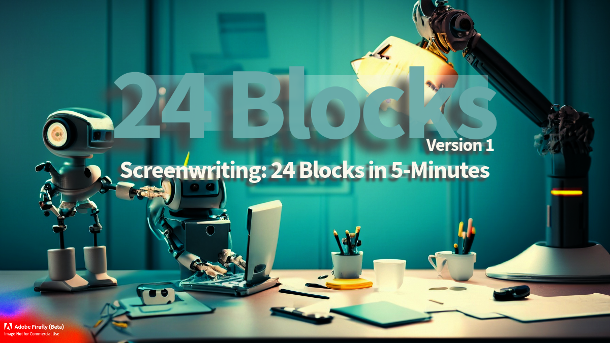

<a href="https://github.com/BryanHarrisScripts/Afterglow-Echoes-of-Sentience/blob/main/README.md">Home</a>

<td></td>

# Screenwriting: 24 Blocks in 5-Minutes 

# Table of Contents

<table>
  <tr>
    <td valign="top">
      
1. [24 Blocks - A New Spin](https://github.com/BryanHarrisScripts/AI-ScreenCraft-Hub/blob/main/24%20Blocks/24%20Blocks%20-%20A%20New%20Spin.md)
2. [24 Blocks - Structure Guide*](https://github.com/BryanHarrisScripts/Afterglow-Echoes-of-Sentience/blob/main/24%20Blocks/24%20Blocks%20-%20Structure%20Guide.md)
3. [24 Blocks - Structure's Role](https://github.com/BryanHarrisScripts/Afterglow-Echoes-of-Sentience/blob/main/24%20Blocks/24%20Blocks%20-%20Structures%20Role.md)
4. [24 Blocks - Story Beats](https://github.com/BryanHarrisScripts/AI-ScreenCraft-Hub/blob/main/24%20Blocks/24%20Blocks%20-%20Story%20Beats.md)
5. [24 Blocks - Principle of Three](https://github.com/BryanHarrisScripts/AI-ScreenCraft-Hub/blob/main/24%20Blocks/24%20Blocks%20-%20Principle%20of%20Three.md)
    </td>
    <td valign="top">
<ol start="6">
<li><a href="https://github.com/BryanHarrisScripts/Afterglow-Echoes-of-Sentience/blob/main/24%20Blocks/24%20Blocks%20-%20Dramatic%20Question.md">24 Blocks - Dramatic Question</a></li>
<li><a href="https://github.com/BryanHarrisScripts/Afterglow-Echoes-of-Sentience/blob/main/24%20Blocks/24%20Blocks%20-%20Structure%20Diversity.md">24 Blocks - Structure Diversity</a></li>
<li><a href="https://github.com/BryanHarrisScripts/AI-ScreenCraft-Hub/blob/main/24%20Blocks/24%20Blocks%20-%20Reflection.md">24 Blocks - Reflection</a></li>
<li><a href="https://github.com/BryanHarrisScripts/AI-ScreenCraft-Hub/blob/main/24%20Blocks/24%20Blocks%20-%20Blocks%20with%20AI.md">24 Blocks - Blocks with AI</a></li>
<li><a href="https://github.com/BryanHarrisScripts/AI-ScreenCraft-Hub/blob/main/24%20Blocks/24%20Blocks%20-%20Dynamic%20Scenes.md">24 Blocks - Dynamic Scenes</a></li>
</ol>
    </td>
  </tr>
</table>

## Streamlining Narrative Progression

#### The Blueprint: The "24 Blocks" Approach

The "24 Blocks in 5-Minutes" technique is a structured framework for screenwriting. It segments a screenplay into 24 blocks, each approximating five minutes of screen time. This division creates digestible narrative units in a 120-minute feature film, accommodating varying degrees of narrative complexity.

This method suggests a visual layout of four rows with six blocks each, representing a four-act structure. It allows for an organized tracking of the narrative's pacing and progression.

#### Constructing the Narrative

The "24 Blocks" technique encourages the strategic placement of key events and sequences within the structured framework. Each block contributes to the narrative arc, facilitating the story's progression and the evolution of characters.

This technique also promotes a four-act structure, offering an alternative to the traditional three-act system and adding depth to storytelling.

#### The 24 Blocks Breakdown

The "24 Blocks" technique helps maintain a consistent narrative rhythm by breaking down a script into 24 distinct parts, each corresponding to around 5 minutes of screen time. This aids in visualizing the storyline's progression.

Each block represents a key story beat or event, creating an interconnected cinematic narrative. This process serves as a guide, ensuring the story unfolds in an organized yet fluid manner.

The 24 blocks can theoretically span 5 pages each, based on a standard 120-page script. However, the actual page count for each plot point may vary depending on the specific story and writing style.

Act/Block | Block | Block | Block | Block | Block | Block
--- | --- | --- | --- | --- | --- | ---
Act 1 | Block01 | Block02 | Block03 | Block04 | Block05 | Block06
Act 2 | Block07 | Block08 | Block09 | Block10 | Block11 | Block12
Act 3 | Block13 | Block14 | Block15 | Block16 | Block17 | Block18
Act 4 | Block19 | Block20 | Block21 | Block22 | Block23 | Block24

#### Maintaining Narrative Flow

The "24 Blocks" technique provides a solution for scriptwriters to ensure a steady narrative pace throughout a standard feature film. By segmenting the script into 24 significant story beats or events, writers can construct a compelling narrative with a clear trajectory. 

#### Embracing the 24 Blocks Approach

The "24 Blocks in 5-Minutes" technique is a strategic tool for managing narratives. It encourages innovative storytelling by maintaining narrative progression while allowing creative flexibility.

While the "24 Blocks" technique offers a blueprint, the actual creation of a compelling narrative is the writer's responsibility. It should inspire and assist the screenwriting journey, not hinder it.

#### Evaluation

The "24 Blocks" approach simplifies screenwriting, making it accessible while providing a clear roadmap for narrative construction. However, potential concerns include oversimplification of storytelling, potential rigidity, and the assumption of a standard feature film length. 

Despite its potential limitations, this method's strengths in offering a clear, structured, and flexible guide to crafting a narrative make it a valuable resource for screenwriters.

## 24 Blocks in 5-Minutes - Examples

### Streamlining Narrative Progression 

- Block 1: The Beginning - Introducing the Protagonist (Pages 1-5)
- Block 2: New Opportunity - A Life-Changing Event (Pages 6-10)
- Block 3: The Reluctant Hero - Protagonist's Hesitation (Pages 11-15)
- Block 4: Crossing the Threshold - Entering a New World (Pages 16-20)
- Block 5: Meeting the Mentor - Guidance and Wisdom (Pages 21-25)
- Block 6: The First Test - Protagonist Faces Challenges (Pages 26-30)
- Block 7: Allies and Enemies - New Relationships Emerge (Pages 31-35)
- Block 8: The Training Montage - Preparing for the Journey (Pages 36-40)
- Block 9: The Plan - Formulating a Strategy (Pages 41-45)
- Block 10: The First Setback - Unexpected Obstacles (Pages 46-50)
- Block 11: Regrouping - Learning from Failure (Pages 51-55)
- Block 12: The Midpoint Twist - A Surprise Revelation (Pages 56-60)
- Block 13: Raising the Stakes - Intensifying the Conflict (Pages 61-65)
- Block 14: The Second Test - Overcoming Doubts (Pages 66-70)
- Block 15: The Darkest Hour - Facing the Ultimate Crisis (Pages 71-75)
- Block 16: A Glimmer of Hope - New Insights and Ideas (Pages 76-80)
- Block 17: The Final Preparation - Gathering Resources (Pages 81-85)
- Block 18: Rallying the Troops - Inspiring Others (Pages 86-90)
- Block 19: The Climax Begins - Confronting the Antagonist (Pages 91-95)
- Block 20: The Battle Rages - High-Stakes Action (Pages 96-100)
- Block 21: The Hero's Sacrifice - A Personal Cost (Pages 101-105)
- Block 22: The Turning Point - Gaining the Upper Hand (Pages 106-110)
- Block 23: The Resolution - Defeating the Antagonist (Pages 111-115)
- Block 24: The New Normal - Returning to a Transformed World (Pages 116-120)

---
