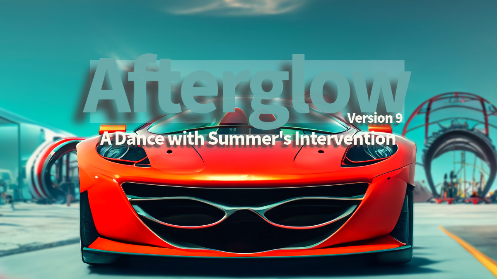

<table>
<tr>
<td>
  
</td>
</tr>
</table>

# Table of Contents

1. [Afterglow - Plot](https://github.com/BryanHarrisScripts/AI-ScreenCraft-Hub/blob/main/Afterglow/Afterglow%20Plot.md)
2. [Afterglow - Theme](https://github.com/BryanHarrisScripts/AI-ScreenCraft-Hub/blob/main/Afterglow/Afterglow%20Theme.md)
3. [Afterglow - Overview](https://github.com/BryanHarrisScripts/AI-ScreenCraft-Hub/blob/main/Afterglow/Afterglow%20Overview.md)
4. [Afterglow - Music Inspirations](https://github.com/BryanHarrisScripts/AI-ScreenCraft-Hub/blob/main/Afterglow/Music%20Inspirations.md)
5. [Afterglow - Movie Inspirations](https://github.com/BryanHarrisScripts/AI-ScreenCraft-Hub/blob/main/Afterglow/Movie%20Inspirations.md)
6. [Afterglow - Software & Tools](https://github.com/BryanHarrisScripts/AI-ScreenCraft-Hub/blob/main/Afterglow/Software%20and%20Tools.md)
7. [Afterglow - Elevator Pitch](https://github.com/BryanHarrisScripts/AI-ScreenCraft-Hub/blob/main/Afterglow/Elevator%20Pitch.md)
8. [Afterglow - Loglines](https://github.com/BryanHarrisScripts/AI-ScreenCraft-Hub/blob/main/Afterglow/Afterglow%20Loglines.md)
---

<h3 align="center">Act 1: Setup - Establishes Characters, Their Objectives, And The Setting</h3>

<table>
<tr>
<td></td>
<td></td>
<td></td>
</tr>
</table>

<table>
<tr>
<td></td>
<td></td>
<td></td>
</tr>
</table>

<table>
<h3 align="center">Act 2: Confrontation - Explores Main Conflicts, Often Increasing Challenges</h3>
<tr>
<td></td>
<td></td>
<td></td>
</tr>
</table>

<table>
<tr>
<td></td>
<td></td>
<td></td>
</tr>
</table>

<table>
<h3 align="center">Act 3: Complication - Introduces Additional Problems Or Obstacles</h3>
<tr>
<td></td>
<td></td>
<td></td>
</tr>
</table>

<table>
<tr>
<td></td>
<td></td>
<td></td>
</tr>
</table>

<table>
<h3 align="center">Act 4: Resolution - Resolves Main Conflicts, And Provides An Ending</h3>
<tr>
<td></td>
<td></td>
<td></td>
</tr>
</table>

<table>
<tr>
<td></td>
<td></td>
<td></td>
</tr>
</table>

---
