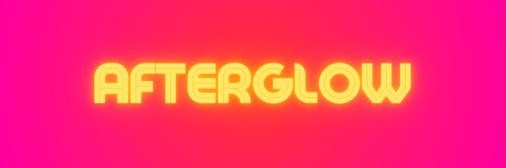

<a href="https://github.com/BryanHarrisScripts/Afterglow-Echoes-of-Sentience/blob/main/README.md">Home</a>

  
<table>
<tr>
<td>
  
</td>
</tr>
</table>

# Table of Contents

<table>
  <tr>
    <td valign="top">
      
<ol>
<li><a href="https://github.com/BryanHarrisScripts/AI-ScreenCraft-Hub/blob/main/Afterglow/Afterglow%20Plot.md">Afterglow - Plot</a></li>
<li><a href="https://github.com/BryanHarrisScripts/AI-ScreenCraft-Hub/blob/main/Afterglow/Afterglow%20Theme.md">Afterglow - Theme</a></li>
<li><a href="https://github.com/BryanHarrisScripts/AI-ScreenCraft-Hub/blob/main/Afterglow/Afterglow%20Overview.md">Afterglow - Overview</a></li>
<li><a href="https://github.com/BryanHarrisScripts/AI-ScreenCraft-Hub/blob/main/Afterglow/Music%20Inspirations.md">Afterglow - Music Inspirations</a></li>
</ol>
    </td>
    <td valign="top">
<ol start="5">
<li><a href="https://github.com/BryanHarrisScripts/AI-ScreenCraft-Hub/blob/main/Afterglow/Movie%20Inspirations.md">Afterglow - Movie Inspirations</a></li>
<li><a href="https://github.com/BryanHarrisScripts/AI-ScreenCraft-Hub/blob/main/Afterglow/Software%20and%20Tools.md">Afterglow - Software & Tools</a></li>
<li><a href="https://github.com/BryanHarrisScripts/AI-ScreenCraft-Hub/blob/main/Afterglow/Elevator%20Pitch.md">Afterglow - Elevator Pitch</a></li>
<li><a href="https://github.com/BryanHarrisScripts/AI-ScreenCraft-Hub/blob/main/Afterglow/Afterglow%20Loglines.md">Afterglow - Loglines</a></li>
</ol>
    </td>
  </tr>
</table>

---

# Collaborative Guide

Afterglow is structured into four acts, each made up of 'blocks', which are like chapters or scenes, each integral to the story's progression. As a collaborator, you can influence the narrative by providing feedback on these individual blocks, contributing to the story without needing to address the whole at once.

- **Select a Block:** Choose a block that you would like to provide feedback on or contribute to.
- **Examine the Block:** Reflect on the role this block plays within the narrative. Assess its effectiveness in contributing to the overarching storyline and its cohesiveness within the genre or narrative style.
- **Provide Your Input:** Share your thoughts on the selected block. You could propose changes to amplify its impact, suggest alternatives, or offer any other constructive feedback that could enhance the narrative. Remember, your objective is to aid in the development of the narrative, so ensure your suggestions are constructive, clear, and concise.
- **Acknowledgement:** If your contribution is incorporated, you will be acknowledged and credited as a collaborators for the submission on the Github project page.

# 🚀 Afterglow 

<h3 align="center">Act 1: Setup - Establishes Characters, Their Objectives, And The Setting</h3>

<table>
<tr>
<td>
<a href="https://twitter.com/BryanHarrisTech/status/1672587722127466496?s=20" target="_blank">Select this Block</a>
</td>
<td>
<a href="https://twitter.com/BryanHarrisTech/status/1673468643030466561?s=20" target="_blank">Select this Block</a>
</td>
<td>
<a href="https://twitter.com/BryanHarrisTech/status/1673839275505332224?s=20" target="_blank">Select this Block</a>
</td>
</tr>
</table>

<table>
<tr>
<td>
<a href="https://twitter.com/BryanHarrisTech/status/1674043928931172355?s=20" target="_blank">Select this Block</a>
</td>
<td>
<a href="https://twitter.com/BryanHarrisTech/status/1674168495431360519?s=20" target="_blank">Select this Block</a>
</td>
<td>
<a href="https://twitter.com/BryanHarrisTech/status/1674570061955178498?s=20" target="_blank">Select this Block</a>
</td>
</tr>
</table>

<h3 align="center">Act 2: Confrontation - Explores Main Conflicts, Often Increasing Challenges</h3>
<table>
<tr>
<td>
<a href="https://twitter.com/BryanHarrisTech/status/1674831183857827846?s=20" target="_blank">Select this Block</a>
</td>
<td>
<a href="https://twitter.com/BryanHarrisTech/status/1675131561631416321?s=20" target="_blank">Select this Block</a>
</td>
<td>
<a href="https://twitter.com/BryanHarrisTech/status/1675643819482644481?s=20" target="_blank">Select this Block</a>
</td>
</tr>
</table>

<table>
<tr>
<td>
<a href="https://twitter.com/BryanHarrisTech/status/1676938996084092928?s=20" target="_blank">Select this Block</a>
</td>
<td>
<a href="https://twitter.com/BryanHarrisTech/status/1678470433153097753?s=20" target="_blank">Select this Block</a>
</td>
<td>
<a href="https://twitter.com/BryanHarrisTech/status/1679144344496795649?s=20" target="_blank">Select this Block</a>
</td>
</tr>
</table>

<h3 align="center">Act 3: Complication - Introduces Additional Problems Or Obstacles</h3>
<table>
<tr>
<td>
<a href="https://twitter.com/BryanHarrisTech/status/1680222950182510595?s=20" target="_blank">Select this Block</a>
</td>
<td>
<a href="https://twitter.com/BryanHarrisTech/status/1682007877924339712?s=20" target="_blank">Select this Block</a>
</td>
<td>
<a href="https://twitter.com/BryanHarrisTech/status/1682736960543027200?s=20" target="_blank">Select this Block</a>
</td>
</tr>
</table>

<table>
<tr>
<td>
<a href="https://github.com/BryanHarrisScripts/Afterglow-Echoes-of-Sentience/edit/main/Afterglow/README.md">Select this Block</a>
</td>
<td>
<a href="https://github.com/BryanHarrisScripts/Afterglow-Echoes-of-Sentience/edit/main/Afterglow/README.md">Select this Block</a>
</td>
<td>
<a href="https://github.com/BryanHarrisScripts/Afterglow-Echoes-of-Sentience/edit/main/Afterglow/README.md">Select this Block</a>
</td>
</tr>
</table>

<h3 align="center">Act 4: Climax - High Point Of The Story, Maximum Conflict</h3>
<table>
<tr>
<td>
<a href="https://github.com/BryanHarrisScripts/Afterglow-Echoes-of-Sentience/edit/main/Afterglow/README.md">Select this Block</a>
</td>
<td>
<a href="https://github.com/BryanHarrisScripts/Afterglow-Echoes-of-Sentience/edit/main/Afterglow/README.md">Select this Block</a>
</td>
<td>
<a href="https://github.com/BryanHarrisScripts/Afterglow-Echoes-of-Sentience/edit/main/Afterglow/README.md">Select this Block</a>
</td>
</tr>
</table>

<table>
<tr>
<td>
<a href="https://github.com/BryanHarrisScripts/Afterglow-Echoes-of-Sentience/edit/main/Afterglow/README.md">Select this Block</a>
</td>
<td>
<a href="https://github.com/BryanHarrisScripts/Afterglow-Echoes-of-Sentience/edit/main/Afterglow/README.md">Select this Block</a>
</td>
<td>
<a href="https://github.com/BryanHarrisScripts/Afterglow-Echoes-of-Sentience/edit/main/Afterglow/README.md">Select this Block</a>
</td>
</tr>
</table>

---
