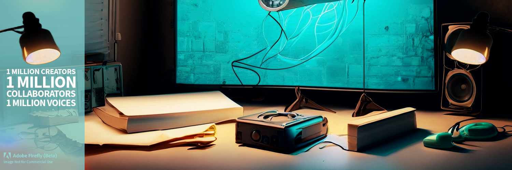

<div align="right" style="display: flex; flex-wrap: wrap; justify-content: center; align-items: center; gap: 1em; margin: 4em 0;">

<a href="https://github.com/BryanHarrisScripts/Afterglow-Echoes-of-Sentience/blob/main/README.md">Home</a>

<div align="left" style="display: flex; flex-wrap: wrap; justify-content: center; align-items: center; gap: 1em; margin: 4em 0;">



<a id="top"></a>

<div align="center">
  
<table>
  <tr>
    <h3>Table of Contents</h3>
    <td>
      <ol>
        <li><a href="#introduction">Introduction</a></li>
        <li><a href="#connect-grow-impact">Connect, Grow, Impact</a></li>
        <li>
          <a href="#how-to-participate">How to Participate</a>
          <ul>
            <li><a href="#contribute-to-afterglow">Contribute to 'Afterglow'</a></li>
            <li><a href="#collaborative-process-on-x">Collaborative Process on X</a></li>
            <li><a href="#create-your-own-version">Create Your Own Version</a></li>
          </ul>
        </li>
      </ol>
    </td>
    <td>
      <ol start="4">
        <li><a href="#benefits-for-collaborators">Benefits for Collaborators</a></li>
        <li><a href="#the-impact">The Impact</a></li>
        <li><a href="#the-open-source-process">The Open-source Process</a></li>
        <li><a href="#traditional-vs-innovation">Traditional vs Innovation</a></li>
        <li><a href="#disclaimer">Disclaimer</a></li>
      </ol>
    </td>
  </tr>
</table>

</div>

---

## 1 MILLION CREATORS, COLLABORATORS, VOICES

### An Open Source Experiment

### Introduction

In a world driven by innovation, the boundaries of creativity are continually expanding. The convergence of technology and artistry gives birth to new ways of thinking, creating, and sharing. This experiment is more than a novel approach to managing intellectual property (IP); it's a blueprint for anyone seeking to navigate the complexities of the digital age.

The experiment's multifaceted objective encompasses not only artistic innovation but a reimagining of monetization. It's about building a brand around a screenplay called "Afterglow," connecting with one million followers, activating ad revenue, and attempting to bring the story to life as a movie. But it goes beyond that. The goal is to utilize new ways to monetize, through the gig economy, ad revenues, and creator economy, even leveraging cryptocurrency and smart contracts. This is a living example that anticipates and adapts to future monetization changes in the world.

By intertwining AI, blockchain, smart contracts, and open-source principles into a 4th wave industrial evolution, this approach forges a community that fosters collaboration and showcases how AI is revolutionizing creativity. It's an invitation for writers, developers, artists, hobbyists, students, and anyone intrigued by innovation to participate, innovate, and explore. Through platforms like GitHub for revision control and exclusive posting on social media platform X, the core values of Storytelling Excellence, Creativity and Innovation, Integrity and Ethical Practice, Collaboration and Teamwork, Respect for Artistic Vision, Audience Engagement, and Sustainability are embraced. Technology here opens new paths, not replaces traditional methods.

The application of the Creative Commons Attribution-ShareAlike 4.0 International (CC-BY-SA-4.0) license to an open-source screenplay fosters global access and collaboration while ensuring recognition of the original work. Together, we're setting the stage for how AI scripts can translate to video and television, reducing costs and time. The acceleration of AI graphics in videos is merely one facet of this groundbreaking innovation.

This is not just an experiment. It's a model, a guide, and an inspiration, laying down a path for creativity in the new world - a path that anyone can follow.

```
Author: Original Author (anonymous for the experiment)  
Assisted by: OpenAI's language model, ChatGPT-4
License: https://creativecommons.org/licenses/by-sa/4.0
Original Work: [Link to the original work]
Modifications:
```

<a href="#top">Back to Top</a>

---

Please let me know if this updated version aligns with your vision!

# Connect, Grow, Impact

**The overarching aim is to gather a community of `1 million followers` around the project. If the project can attract a significant following, it can help promote the original work and provide a framework to grow and impact a vast audience.**

**If successful, this experiment could demonstrate a potential method for managing and promoting creative work in the digital age. It could provide a `blueprint` for artists to grow their audience, impact a broad community, and foster collaborative creativity.**

This project is about more than just amassing followers; it's about building a community around a shared creative endeavour. The larger the community, the greater the collective creativity, the more significant the impact.

**`Every voice counts. Join us, and be one of the million!`**

<a href="#top">Back to Top</a>

# How to Participate 

Collaboration is at the heart of this project, and your involvement is invaluable. Whether you are a screenplay writer, an avid reader, or simply someone excited about the concept of open-source creativity, there's a place for you in this experiment. Here are some ways you can participate:

### Contribute to 'Afterglow'
If you have an idea that you believe would improve the screenplay, we would love to hear from you. We provide two options for contributors depending on your preferences and familiarity with screenplay writing software:

- **Final Draft or Equivalent Software:** If you're comfortable using Final Draft or similar professional-grade software, you can provide input using these tools. 

- **Fountain Format:** If you're unfamiliar with such software, don't worry! We also have a process where you can contribute using the `.fountain` plain text markup format for writing screenplays.

### Collaborative Process on X
In the spirit of collaboration, this link [👉🏼 To Afterglow on X](https://github.com/BryanHarrisScripts/Afterglow-Echoes-of-Sentience/blob/main/Afterglow/README.md), is where you can join the dialogue around the screenplay's development. Here, you can provide your suggestions, ideas, and feedback on each chapter of the project, fostering a more in-depth, interactive collaborative process.

If you're interested in the project, we encourage you to use this platform to voice your thoughts and suggestions. Should your input shape a particular sequence, you will be credited for your contribution. This process is not only an opportunity to influence a screenplay but also a fantastic chance to become part of a vibrant community and contribute to a potentially game-changing experiment in open-source creativity. Let's shape this journey together!

Now, `"👉🏼 To Afterglow on X"` is a clickable link that takes the reader directly to the GitHub page where you can collaborate.

### Create Your Own Version
For those of you who would like to express your creativity more freely, we provide an option for you to create your own adaptation of the screenplay. You can put your unique spin on the story and submit it to our 'Contributors' directory on Github.

Whichever method of participation suits you best, your involvement will help shape this experiment and contribute to the wider discussion on open-source creativity. Remember, this is not just about creating a screenplay - it's about exploring new ways of creating, collaborating, and sharing in the digital age. 

<a href="#top">Back to Top</a>

### Benefits for Collaborators

The experiment offers unique benefits for all collaborators:

- **Gaining Exposure:** Through their contribution to the project, collaborators have an opportunity to gain widespread exposure for their work.

- **Adapting and Experimenting:** Collaborators are free to utilize the experiment, follow the process or adapt it to their needs. The open-source nature of the project encourages exploration and experimentation.

- **Learning and Growing:** Working on a global platform with diverse collaborators provides a unique learning experience and a chance to grow professionally.

<a href="#top">Back to Top</a>

### The Impact

While the experiment focuses on a screenplay, the principles and strategies can apply to any creative work, from novels and music to art and digital media. It's an exploration of new ways of creating and sharing in a digitally connected world, and a demonstration of the potential power of open-source principles in creative fields.

Open-source principles have already been applied successfully in numerous projects, such as [Project Gutenberg](https://www.gutenberg.org/). This project has demonstrated the potential of open-source for creating a vast, shared repository of literary works.

Open-source projects often raise questions about recognition, copyright, and conflict resolution. The CC-BY-SA-4.0 license ensures that all contributors receive appropriate credit for their work. The project also fosters an inclusive, respectful environment and encourages open dialogue to resolve any potential conflicts.

<a href="#top">Back to Top</a>

### The Open-source Process

- **Release the Work Under an Open-Source License:** The first step involves releasing a screenplay under the CC-BY-SA-4.0 license.

- **Build an Online Presence:** This involves creating a strong online presence where the project can live, grow, and thrive.

- **Promote and Connect:** Through strategic and consistent promotions, reach out to potential collaborators, contributors, and followers.

- **Foster Collaboration:** Encourage remixes, adaptations, and transformative works.

- **Monitor and Adapt:** Continually assess the growth and impact of the project, adapting strategies as necessary based on the feedback and trends.

<a href="#top">Back to Top</a>

### Traditional vs Innovation

| Aspect                         | Traditional Approach                                                                                                                                                     | Innovative Approach                                                                                                                                   |
|--------------------------------|--------------------------------------------------------------------------------------------------------------------------------------------------------------------------|-------------------------------------------------------------------------------------------------------------------------------------------------------|
| **Script Development**         | Script developed by individual writers or a team, often with multiple rounds of edits and revisions. Writers are generally hired and paid for their work.                 | Open collaboration and use of AI for enhancing language. Version control through GitHub and collaborative inputs under a clear legal framework.      |
| **Legal Agreements and IP**    | Comprehensive contracts governing rights, royalties, credit, and other legal aspects. Union guidelines must be adhered to.                                                 | Use of Creative Commons licenses and possibly a Contributor License Agreement (CLA) to manage collaboration and intellectual property.                 |
| **Quality Control**            | Multiple rounds of review with producers, directors, and possibly studio executives.                                                                                      | Collaborative editing and use of AI for linguistic enhancement, with version control through GitHub.                                                   |
| **Funding**                    | Typically financed through production companies, investors, or studios. Strict oversight on budget and timelines.                                                           | Potential use of crowdfunding, cryptocurrency, and community-driven funding approaches.                                                                |
| **Community and Collaboration**| Hierarchical collaboration with well-defined roles and responsibilities. Writers, directors, producers, and other key players work in defined capacities.                  | Open collaboration, possibly with the wider community. Transparent and inclusive processes, managed through platforms like GitHub.                      |
| **Monetization and Revenue**   | Revenue distributed through contracts, with unions potentially governing certain aspects.                                                                                 | Transparent revenue-sharing model, possibly automated through smart contracts.                                                                         |
| **Technology and Innovation**  | Limited scope for leveraging AI and open-source collaboration. Technology used mainly in production and post-production.                                                  | Embracing AI for script refinement, utilizing open-source principles, and exploring technologies like blockchain for monetization.                       |
| **Ethical and Regulatory**     | Adherence to union guidelines, industry standards, and legal regulations.                                                                                                 | Compliance with Creative Commons licensing, data protection laws, and development of ethical guidelines for collaboration.                               |
| **Market Acceptance**          | Established pathways to market, distribution channels, and audience engagement.                                                                                          | Potential need to forge new pathways and gain acceptance for a non-traditional approach to content creation.                                            |

<a href="#top">Back to Top</a>

#
### Disclaimer

This experiment is hypothetical and theoretical. It's an exploration of possibilities and doesn't guarantee success. It's crucial to consult with a legal professional before deciding to adopt an open-source model for managing creative works.
#

<div align="center">
<h3>1 MILLION CREATORS, COLLABORATORS, VOICES</h3>
<h4>YOUR NAME, YOUR BRAND, YOUR CREATIVITY!</h4>
</div>

------
