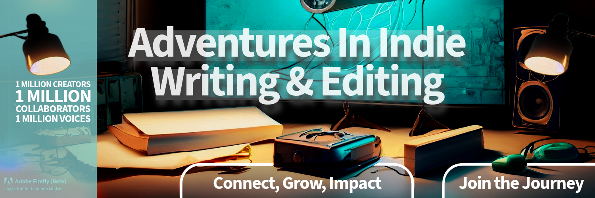

# 1 Million Voices: Your Name, Your Brand, Your Creativity!

### An Open Source Experiment 

### Introduction

This experiment seeks to explore an innovative and potentially powerful strategy for managing intellectual property (IP) in the digital age - particularly for IPs like screenplays. By applying an open-source licensing model, it's possible to foster collaborative creativity while preserving the recognition of the original author. This approach presents unique opportunities for a vibrant, shared creative space. 

The experiment will apply the Creative Commons Attribution-ShareAlike 4.0 International (CC-BY-SA-4.0) license to an open-source screenplay. This licensing model facilitates global access, extensive collaborations, and ensures recognition of the original work.

````
Author: Original Author (anonymous for the experiment)  
Assisted by: OpenAI's language model, ChatGPT-4
License: https://creativecommons.org/licenses/by-sa/4.0
Original Work: [Link to the original work]
Modifications:
````

### The Goal: Connect, Grow, Impact!

The overarching aim is to gather a community of 1 million followers around the project. If the project can attract a significant following, it can help promote the original work and provide a framework to grow and impact a vast audience. 

### Benefits for Collaborators

The experiment offers unique benefits for all collaborators:

1. **Gaining Exposure:** Through their contribution to the project, collaborators have an opportunity to gain widespread exposure for their work.

2. **Adapting and Experimenting:** Collaborators are free to utilize the experiment, follow the process or adapt it to their needs. The open-source nature of the project encourages exploration and experimentation.

3. **Learning and Growing:** Working on a global platform with diverse collaborators provides a unique learning experience and a chance to grow professionally.

### The Process

1. **Release the Work Under an Open-Source License:** The first step involves releasing a screenplay under the CC-BY-SA-4.0 license.

2. **Build an Online Presence:** This involves creating a strong online presence where the project can live, grow, and thrive.

3. **Promote and Connect:** Through strategic and consistent promotions, reach out to potential collaborators, contributors, and followers.

4. **Foster Collaboration:** Encourage remixes, adaptations, and transformative works.

5. **Monitor and Adapt:** Continually assess the growth and impact of the project, adapting strategies as necessary based on the feedback and trends.

### The Impact
If successful, this experiment could demonstrate a potential method for managing and promoting creative work in the digital age. It could provide a blueprint for artists to grow their audience, impact a broad community, and foster collaborative creativity.

This project is about more than just amassing followers; it's about building a community around a shared creative endeavor. The larger the community, the greater the collective creativity, the more significant the impact.

While the experiment focuses on a screenplay, the principles and strategies can apply to any creative work, from novels and music to art and digital media. It's an exploration of new ways of creating and sharing in a digitally connected world, and a demonstration of the potential power of open-source principles in creative fields.

### Examples and Precedents

Open-source principles have already been applied successfully in numerous projects, such as [Project Gutenberg](https://www.gutenberg.org/). This project has demonstrated the potential of open-source for creating a vast, shared repository of literary works.

### Resolving Concerns

Open-source projects often raise questions about recognition, copyright, and conflict resolution. The CC-BY-SA-4.0 license ensures that all contributors receive appropriate credit for their work. The project also fosters an inclusive, respectful environment and encourages open dialogue to resolve any potential conflicts.

### Join 1 Million Creators, Collaborators, Voices

**Your Creativity, Your Brand, Our Impact Together!**  
**Discover, Connect, Create - Rewrite the Future!**

[Join 1 Million Voices](https://twitter.com/BryanHarrisTech)

### Disclaimer

This experiment is hypothetical and theoretical. It's an exploration of possibilities and doesn't guarantee success. It's crucial to consult with a legal professional before deciding to adopt an open-source model for managing creative works.

---
