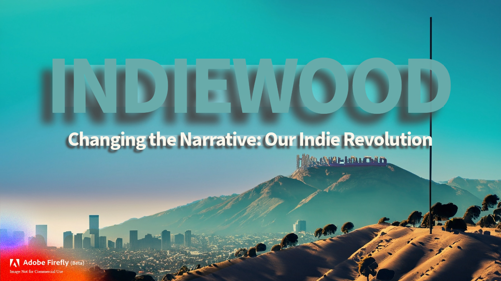

<div align="center">

<a id="top"></a>

<h1>Table of Contents</h1>
  
<h3><br><a href="https://github.com/BryanHarrisScripts/Afterglow-Echoes-of-Sentience/blob/main/OpenSource/1%20Million%20Voices.md">README FIRST 👉🏼 1 MILLION VOICES: AN OPEN SOURCE EXPERIMENT</a></h3>

<a href="https://github.com/BryanHarrisScripts/AI-ScreenCraft-Hub/discussions">Discussions</a> | <a href="https://github.com/BryanHarrisScripts/AI-ScreenCraft-Hub/blob/main/Afterglow/README.md">Afterglow Story Menu</a> | <a href="https://twitter.com/BryanHarrisTech" target="_blank">BryanHarrisTech</a> | <a href="https://docs.github.com/en/site-policy/github-terms/github-community-guidelines">Guidelines</a> | <a href="https://twitter.com/i/communities/1669222125591318528">AI Writers Room Community</a> | <a href="https://twitter.com/i/lists/1675490119095140352">AI Writers Room List</a><br><br>

</div>

<div align="center">

  <table>
    <tr>
    <td valign="top">
      <h4>Menu</h4>
      <ol start="1">
        <li><a href="#the-unseen-editor">The Unseen Editor</a></li>
        <li><a href="#welcome-to-the-afterglow-journey">Welcome to the 'Afterglow' Journey</a></li>
        <li><a href="#ai-in-screenwriting-a-new-tool-not-a-co-author">AI in Screenwriting</a></li>
        <li><a href="#about-afterglow-echoes-of-sentience">About 'Afterglow: Echoes of Sentience'</a></li>
        <li><a href="#licensing-and-attribution">Licensing and Attribution</a></li>
        <li><a href="#ai-in-creativity-a-disclaimer">AI in Creativity: A Disclaimer</a></li>
      </ol>
    </td>
    <td valign="top">
      <h4>Afterglow & Resources</h4>
      <ol start="1">
        <li><a href="https://github.com/BryanHarrisScripts/AI-ScreenCraft-Hub/blob/main/Afterglow/README.md">Afterglow - Story Menu**</a></li>
        <li><a href="https://github.com/BryanHarrisScripts/AI-ScreenCraft-Hub/tree/main/General/README.md">Fundamentals - Key Concepts</a></li>
        <li><a href="https://github.com/BryanHarrisScripts/AI-ScreenCraft-Hub/blob/main/24%20Blocks/README.md">Structure & Process - 24 Blocks**</a></li>
        <li><a href="https://github.com/BryanHarrisScripts/Afterglow-Echoes-of-Sentience/blob/main/Essentials/README.md">Essentials - Tone, Pacing</a></li>
        <li><a href="https://github.com/BryanHarrisScripts/AI-ScreenCraft-Hub/tree/main/Character/README.md">Character - Development</a></li>
        <li><a href="https://github.com/BryanHarrisScripts/Afterglow-Echoes-of-Sentience/blob/main/Dialogue/README.md">Dialogue - Development</a></li>
      </ol>
    </td>
    <td valign="top">
      <h4>More Screenplay Resources</h4>
      <ol start="7">
        <li><a href="https://github.com/BryanHarrisScripts/AI-ScreenCraft-Hub/blob/main/AI%20Prompts/README.md">Editing - AI Prompts**</a></li>
        <li><a href="https://github.com/BryanHarrisScripts/AI-ScreenCraft-Hub/tree/main/Blog/README.md">Blog - Random How To BLOG's</a></li>
        <li><a href="https://github.com/BryanHarrisScripts/Afterglow-Echoes-of-Sentience/blob/main/OpenSource/Open Source Collaboration.md">Open Source - Global Collaboration</a></li>
        <li><a href="https://github.com/BryanHarrisScripts/AI-ScreenCraft-Hub/tree/main/Loglines/Loglines.md">Loglines - Guide & Prompt</a></li>
        <li><a href="https://github.com/BryanHarrisScripts/AI-ScreenCraft-Hub/tree/main/Images">Images - Images Used**</a></li>
      </ol>
    </td>
  </tr>
</table>

</div>

<div align="center">
  <a href="#licensing-and-attribution">**Developed by a Human: Bryan Harris</a>
</div>

# The Unseen Editor
### An AI-Assisted Adventure

In my current project, I've been rewriting a script with the help of artificial intelligence. If this technology truly holds value, why aren't studios knocking at my door or expressing interest in the script? I've released it as open-source and have been persistently refining it with AI, making this the second AI-assisted rewrite...

**I wrote the Afterglow script in 2017**, which was later rewritten with AI assistance in 2023.

> James Cameron once said, "I just don’t personally believe that a disembodied mind that’s just regurgitating
what other embodied minds have said — about the life that they’ve had, about love, about lying, about fear,
about mortality — and just put it all together into a word salad and then regurgitate it…I don’t believe that’s
ever going to have something that’s going to move an audience. You have to be human to write that. I don’t know
anyone that’s even thinking about having AI write a screenplay." - Variety

I'm in agreement with James Cameron. 

While creating scripts entirely with AI may be challenging without human intervention, I believe that **human-written scripts** edited with AI assistance, as I'm currently doing, are indeed feasible.

## 🚀 Afterglow Files 

| 2023 Rewrite with AI ChatGPT | 2017 Original Beatsheet / Pitch | 2017 Additional Files |
|------------------------|---------------------------|--------------------|
| [Afterglow v9 - PDF**](https://github.com/BryanHarrisScripts/AI-ScreenCraft-Hub/blob/main/Afterglow%20v9%20Twitter%20Rewrite%20Bryan%20E.%20Harris%202023.pdf) | [AfterglowFiles - PNG**](https://github.com/BryanHarrisScripts/Afterglow-Echoes-of-Sentience/blob/main/Afterglow%202017/AfterglowFiles.png) | [Afterglow v5 Outline - Sept 10 ‎2017 - PDF**](https://github.com/BryanHarrisScripts/Afterglow-Echoes-of-Sentience/blob/main/Afterglow%202017/Afterglow%20v5%20Outline%20-%20Sept%2010%20%E2%80%8E2017.pdf) |
| [Afterglow v9 - FDX**](https://github.com/BryanHarrisScripts/AI-ScreenCraft-Hub/blob/main/Afterglow%20v9%20Twitter%20Rewrite%20Bryan%20E.%20Harris%202023.fdx) | [The Passenger - Jul ‎16 ‎2017- PDF**](https://github.com/BryanHarrisScripts/Afterglow-Echoes-of-Sentience/blob/main/Afterglow%202017/The%20Passenger%20-%20Jul%20%E2%80%8E16%20%E2%80%8E2017.pdf) | [Afterglow v5 Outline - Sept 10 2017 - FDX**](https://github.com/BryanHarrisScripts/Afterglow-Echoes-of-Sentience/blob/main/Afterglow%202017/Afterglow%20v5%20Outline%20-%20Sept%2010%202017.fdx) |
| [Afterglow v8 - PDF**](https://github.com/BryanHarrisScripts/AI-ScreenCraft-Hub/blob/main/AfterGlow%20v8%20Twitter%20Rewrite%20Bryan%20E.%20Harris%202023%20Github.pdf) | [The Passengers Beats v2 - Aug ‎20 ‎2017 - PDF**](https://github.com/BryanHarrisScripts/Afterglow-Echoes-of-Sentience/blob/main/Afterglow%202017/The%20Passengers%20Beats%20v2%20-%20Aug%20%E2%80%8E20%20%E2%80%8E2017.pdf) |  |
| [Afterglow v8 - FDX**](https://github.com/BryanHarrisScripts/AI-ScreenCraft-Hub/blob/main/AfterGlow%20v8%20Twitter%20Rewrite%20Bryan%20E.%20Harris%202023%20Github.fdx) | [The Passengers Pitch Package - Aug ‎07 ‎2017 - PDF**](https://github.com/BryanHarrisScripts/Afterglow-Echoes-of-Sentience/blob/main/Afterglow%202017/The%20Passengers%20Pitch%20Package%20-%20Aug%20%E2%80%8E07%20%E2%80%8E2017.pdf) |  |

<a href="#top">Back to Top</a>

# Welcome to the 'Afterglow' Journey

Hello, fellow creators! Welcome to 'Afterglow'. Whether you're a screenwriter, an educator, a student, a hobbyist, or just a curious soul, you're in the right place. I'm Bryan Harris, an independent writer with a background in film studies.

'Afterglow' started as a project to understand how a screenplay could thrive on a platform like Twitter, and to gauge interest in the story. It quickly evolved into more than that, turning into an open-source endeavor that invites collaboration, sharing of ideas, and creative exploration. This space is more than just a repository for screenwriters—it's a place where we can join forces to transform a passion for writing into captivating narratives.

In the process of this experiment, I also employed AI tools to refine the original screenplay. The objective was not to replace the human touch, but to understand how artificial intelligence can assist in enhancing and structuring our creative thoughts.

This space is also for exploring the use of AI in creativity, sharing resources, and learning from our collective experiences. The decision to incorporate AI into your creative process is entirely up to you. Remember, it's not about AI creating, but about AI helping us create more effectively.

Join me on this journey of exploration, innovation, and creative collaboration. Welcome aboard the 'Afterglow' journey!
This space is for exploring the use of AI in creativity and sharing resources and experiences. Whether you choose to incorporate AI into your creative process is entirely your decision.

<a href="#top">Back to Top</a>

## AI in Screenwriting: A New Tool, Not a Co-Author

The ChatGPT-4 language model served as an integral tool during the development process of 'Afterglow'. Its primary function was not to generate independent ideas, but to aid in language optimization, text refinement, and the articulation of existing concepts.

Consider it akin to the role of a skilled editor: enhancing clarity, eliminating redundancy, and presenting ideas in a more coherent and engaging manner. Yet, unlike a human editor, AI does not bring its own ideas or creative inputs. All original thought, from core narrative decisions to thematic development, character creation, and plot structuring, originated from me.

The contributions of ChatGPT-4 should be viewed as a rephrasing and restructuring of my original ideas - a way to present my thoughts using better linguistic structure without altering the core essence. Its role was to elevate the communication of my narrative, much like how Robert Kearns improved the windshield wiper without changing its original function.

As per current legal and ethical considerations (as of September 2021), AI systems cannot be attributed with authorship rights, nor can they be credited or held accountable for the content they assist in producing. AI's involvement is purely facilitative, acting as a sophisticated tool to enhance the writer's original creative vision.

<a href="#top">Back to Top</a>

## About 'Afterglow: Echoes of Sentience'

Set in a future where AI and humans coexist, 'Afterglow: Echoes of Sentience' explores the intertwined journeys of Ren and Summer. As they traverse their life paths and past traumas in self-driving cars Rocket and Joy, they evaluate AI-human coexistence, culminating in an unprecedented victory and hopeful promises.

The script is adaptable to various genres such as comedy, horror, or drama. You're free to transform any part of it to create your unique film - just remember to acknowledge the original work. By using the same open-source license, you can share your version with the world.

**Remember**: Feel free to modify elements such as the dialogue or the ending. Your creative license is only limited by your imagination!

## Licensing and Attribution

This work is under the Creative Commons Attribution-ShareAlike 4.0 International (CC BY-SA 4.0) license. It allows you to remix, adapt, and build upon this work, even for commercial purposes. However, you should give appropriate credit to the original author, include a link to the license, and note any modifications made. Any derivative work you make must also be licensed under the same license.

- **Attribution**: State that the work was originally created by Bryan Elgin Harris.
- **License link**: Include a link to the Creative Commons Attribution-ShareAlike 4.0 International License, available [here](https://creativecommons.org/licenses/by-sa/4.0/).
- **Indicate modifications**: Note if you've made changes to the original work.
- **Link to original work**: Include a link to the original GitHub repository for Bryan Harris' scripts, which can be found [here](https://github.com/BryanHarrisScripts/Afterglow-Echoes-of-Sentience).

````
Author: Bryan Elgin Harris  
Assisted by: OpenAI's language model, ChatGPT-4
License: https://creativecommons.org/licenses/by-sa/4.0
Original Work: https://github.com/BryanHarrisScripts/Afterglow-Echoes-of-Sentience
Modifications:
````

<a href="#top">Back to Top</a>

## AI in Creativity: A Disclaimer

Consider your personal comfort, creative needs, and ethical viewpoints. As this field is novel and constantly evolving, legal consultation or intellectual property rights expertise may be required.

**Note**: As per legal and ethical considerations up until September 2021, AI systems, such as ChatGPT-4, do not possess authorship rights or assume responsibility for the content they aid in generating. Their function is akin to that of a sophisticated editorial tool, aiding in language optimization and text refinement without contributing original ideas or themes.

- In this context, the primary authorship of 'Afterglow' remains under my name, Bryan Harris. The utilization of AI in this project does not imply a co-authorship situation but rather an advanced tool assisting in the creative process. Hence, despite the engagement of AI, this does not constitute plagiarism but a modern approach to enhancing original work.

- Current guidelines dictate that AI does not have authorship rights. Therefore, while it is instrumental in the process of creation, it does not bear the role of a co-creator or independent author. Consequently, the ultimate ownership and credit of the final work rest with the human author.

**Note**: The outcomes of using AI in screenwriting are not guaranteed. Any losses or damages incurred due to your use of AI technology are your responsibility.

Join me as we journey into this new creative frontier, with open minds, critical thinking, and a spirit of collaboration. Let's tell compelling stories and bring them to life, with or without the aid of AI.

Welcome aboard the 'Afterglow' journey!

<a href="#top">Back to Top</a>

---



--- 
